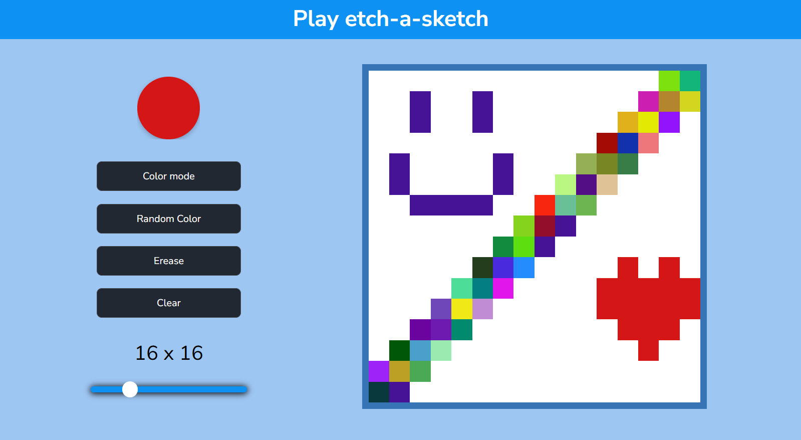

# 🎨 Etch A Sketch - Proyecto de dibujo interactivo

Este proyecto es una versión digital del clásico Etch A Sketch, construido con **JavaScript**, **HTML** y **CSS**. Permite a los usuarios pintar en una cuadrícula interactiva usando diferentes modos: color sólido, colores aleatorios (modo arcoíris), y borrador.

---

## 🚀 Funcionalidades principales

- 🎨 Selección de color personalizado
- 🌈 Modo de pintura con colores aleatorios
- 🧽 Modo borrador
- 📏 Control del tamaño de la cuadrícula mediante un slider dinámico
- 🔄 Botón para limpiar la cuadrícula completa
- 🖱️ Interacción con el mouse (click y arrastre para pintar)

---

## 🧠 Lo que aprendí

Este proyecto me ayudó a fortalecer varios conceptos importantes de desarrollo web, especialmente en **JavaScript puro**:

- Manipulación dinámica del **DOM**
- Uso de **eventos del mouse** (`mousedown`, `mouseup`, `mouseover`)
- Aplicación de **funciones puras** para separar lógica de interacción
- Control de estados mediante **banderas lógicas (flags)** para activar/desactivar modos de pintura
- Creación y limpieza dinámica de elementos con `createElement` y `innerHTML`
- Cálculo dinámico del tamaño de los elementos de la cuadrícula usando `calc()` y `aspect-ratio`
- Manejar tareas asignadas en funciones específicas

---

## 🛠️ Tecnologías utilizadas

- HTML5
- CSS3 (estilos básicos + `flexbox`)
- JavaScript (Vanilla JS, sin frameworks)

---

## 📸 Capturas de pantalla



---

## 🧩 Cómo utilizarlo

1. Clonar este repositorio:

```bash
   git clone https://github.com/JulianBcb07/etch-a-sketch.git
```

2. Abrir el archivo `index.html` en el navegador
3. ¡Empezar a pintar! 🖼️

---

<h4 align="center">
👨‍💻 Autor Julian Bacab – [@JulianBcb07](https://github.com/JulianBcb07)
</h4>

---

<h4 align="center">
🚀 Link del proyecto - https://julianbcb07.github.io/etch-a-sketch/
</h4>

---
